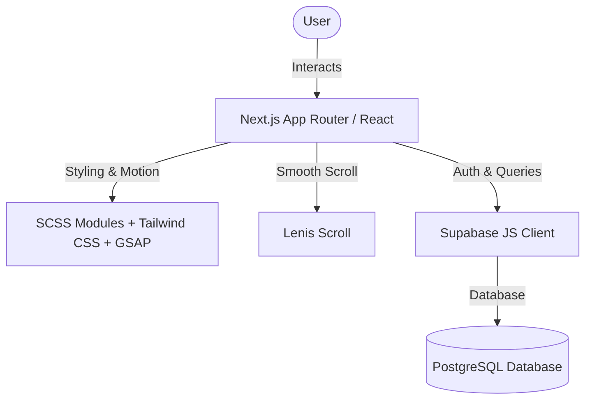
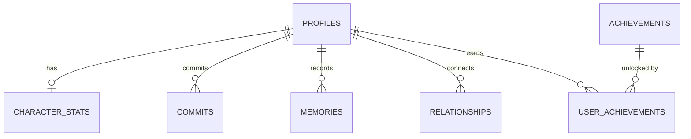
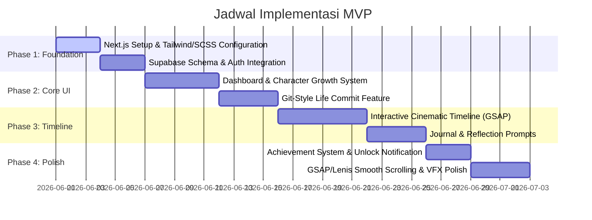
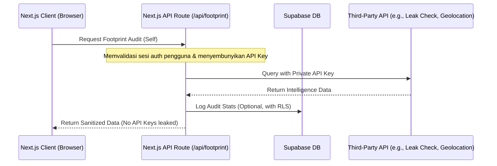

# IMPLEMENTATION PLAN: Version of Me (MVP)

Rencana implementasi ini dirancang untuk mewujudkan konsep **"Your life, versioned"** ke dalam sebuah web application premium dengan estetika sinematik, interaksi halus, dan arsitektur database yang solid.

---

## 🛠️ 1. Tech Stack & Architecture

Sesuai dengan PRD, berikut adalah arsitektur teknis yang akan kita bangun:

*   **Frontend**: Next.js (App Router) untuk performa optimal, routing modern, dan dukungan SSR/Static rendering.
*   **Styling**: SCSS Modules (atau Tailwind CSS yang dikombinasikan dengan SCSS untuk custom dark premium atmosphere).
*   **Motion & Animation**: GSAP (GreenSock) untuk koordinasi timeline animasi yang kompleks & Framer Motion untuk mikro-interaksi komponen.
*   **Smooth Scroll**: Lenis Scroll untuk memberikan sensasi scrolling sinematik nan mulus.
*   **Backend & Auth**: Supabase (PostgreSQL) sebagai database utama, sistem autentikasi (Email/Google), dan real-time listener jika diperlukan kelak.

---

## 🗄️ 2. Database Schema (PostgreSQL di Supabase)

Untuk mendukung semua fitur MVP, berikut adalah rancangan skema tabel database yang saling berelasi secara optimal:

### 1. Table: `profiles`
Menyimpan profil dasar pengguna.
*   `id`: UUID (Primary Key, references `auth.users`)
*   `username`: VARCHAR(50) (Unique)
*   `display_name`: VARCHAR(100)
*   `avatar_url`: TEXT
*   `created_at`: TIMESTAMP WITH TIME ZONE

### 2. Table: `character_stats`
Atribut pertumbuhan karakter digital pengguna.
*   `id`: UUID (Primary Key)
*   `user_id`: UUID (Foreign Key references `profiles.id` ON DELETE CASCADE)
*   `level`: INTEGER (Default 1)
*   `xp`: INTEGER (Default 0)
*   `confidence`: INTEGER (Range 0-100, Default 50)
*   `discipline`: INTEGER (Range 0-100, Default 50)
*   `happiness`: INTEGER (Range 0-100, Default 50)
*   `creativity`: INTEGER (Range 0-100, Default 50)
*   `social_energy`: INTEGER (Range 0-100, Default 50)
*   `emotional_stability`: INTEGER (Range 0-100, Default 50)
*   `updated_at`: TIMESTAMP WITH TIME ZONE

### 3. Table: `commits` (Life Commits)
Catatan perubahan emosional ala Git commit.
*   `id`: UUID (Primary Key)
*   `user_id`: UUID (Foreign Key references `profiles.id` ON DELETE CASCADE)
*   `hash`: VARCHAR(7) (Otomatis dibuat seperti commit hash pendek, misal `a8f3d1b`)
*   `title`: TEXT (Contoh: "learned to let go")
*   `description`: TEXT (Detail refleksi)
*   `mood_level`: INTEGER (Skala 1-5, merepresentasikan emosi saat commit)
*   `emotional_tags`: TEXT[] (Array tag emosi, misal `["healing", "growth", "social"]`)
*   `created_at`: TIMESTAMP WITH TIME ZONE

### 4. Table: `memories` (Life Timeline Events)
Peristiwa penting dalam hidup (timeline).
*   `id`: UUID (Primary Key)
*   `user_id`: UUID (Foreign Key references `profiles.id` ON DELETE CASCADE)
*   `title`: VARCHAR(255)
*   `description`: TEXT
*   `category`: VARCHAR(50) (e.g., `Milestone`, `Career`, `Health`, `Routine`)
*   `event_date`: DATE (Tanggal kejadian sebenarnya)
*   `media_url`: TEXT (Foto pendukung)
*   `audio_url`: TEXT (Musik pendukung/soundtrack memory)
*   `mood`: VARCHAR(50)
*   `created_at`: TIMESTAMP WITH TIME ZONE

### 5. Table: `relationships`
Pemetaan hubungan sosial yang memengaruhi pertumbuhan karakter.
*   `id`: UUID (Primary Key)
*   `user_id`: UUID (Foreign Key references `profiles.id` ON DELETE CASCADE)
*   `name`: VARCHAR(255)
*   `status`: VARCHAR(50) (e.g., `Active`, `Faded`, `Archived`, `Lost Connection`)
*   `emotional_impact`: INTEGER (Skala -5 sampai +5)
*   `last_interaction`: DATE
*   `created_at`: TIMESTAMP WITH TIME ZONE

### 6. Table: `achievements` & `user_achievements`
Sistem pencapaian hidup.
*   `id`: UUID (Primary Key)
*   `title`: VARCHAR(255) (e.g., "30 Days Consistency")
*   `description`: TEXT
*   `icon_name`: VARCHAR(100)
*   `xp_reward`: INTEGER
*   `user_achievements`: Tabel jembatan (`user_id`, `achievement_id`, `unlocked_at`)

---

## 🎨 3. Design System & Visual Atmosphere

Aplikasi ini wajib memiliki estetika **"Dark Premium & Cinematic Reflection Space"**.

### Palette Warna (Dark Glassmorphism)
*   **Deep Background**: `hsl(240, 10%, 4%)` (Hampir hitam, sangat pekat untuk kenyamanan refleksi malam hari).
*   **Surface/Card**: `rgba(20, 20, 25, 0.6)` dengan `backdrop-filter: blur(12px)` dan border tipis `rgba(255, 255, 255, 0.08)`.
*   **Accent Glows**:
    *   *Positive Growth (Discipline/Confidence)*: Teal/Cyan `hsl(180, 70%, 50%)`
    *   *Emotional Arc (Healing/Reflective)*: Indigo/Purple `hsl(260, 60%, 65%)`
    *   *Melancholic/Vulnerable*: Muted Amber `hsl(35, 60%, 55%)`

### Tipografi
*   **Header Emosional (Serif)**: *Playfair Display* atau *Lora* (Google Fonts) untuk memberikan nuansa literatur/diari premium.
*   **Readability (Sans-Serif)**: *Outfit* atau *Inter* untuk UI navigasi dan teks panjang.
*   **System/Git Elements (Monospace)**: *Fira Code* atau *JetBrains Mono* untuk Hash commits, tag, dan status statistik.

---

## 📅 4. Tahapan Implementasi (Milestone)

### Phase 1: Foundation & Setup
1.  Inisialisasi proyek Next.js dengan App Router dan dukungan SCSS/Tailwind.
2.  Konfigurasi global layout dengan Lenis Scroll agar semua halaman memiliki *smooth scroll*.
3.  Membuat skema database PostgreSQL di Supabase lengkap dengan kebijakan keamanan Row Level Security (RLS).
4.  Implementasi otentikasi (Sign Up/Sign In) dengan transisi antarmuka yang sangat dramatis/cinematic.

### Phase 2: Dashboard & Character Growth
1.  **Digital Avatar Visualization**: Membuat representasi karakter digital dalam bentuk visual abstrak (misalnya, lingkaran aura bercahaya / particle glow system yang ukurannya, warna, serta gerakannya berubah dinamis sesuai nilai statistiknya).
2.  **Interactive Stats Grid**: Kartu status (Confidence, Discipline, Happiness, dll.) yang interaktif dengan *hover hover micro-interactions* dan grafik pertumbuhan kecil.

### Phase 3: Life Commits & Cinematic Timeline
1.  **Commit Command Line / Box**: Form pembuatan *life commit* dengan desain layaknya developer terminal namun tetap elegan. Pengguna dapat mengetik judul commit, memilih tag emosi, dan menggeser slider tingkat mood.
2.  **Git-style History List**: Daftar riwayat *commit* vertikal dengan garis pembubung putus-putus ala git history graph.
3.  **Horizontal Timeline / Parallax**: Tampilan utama *Life Timeline* secara horizontal. Menggunakan GSAP untuk melakukan perpindahan tahun/bulan secara sinematik dengan efek paralaks kedalaman foto.

### Phase 4: Refleksi, Pencapaian & Sentuhan Akhir
1.  **Journal Room**: Antarmuka menulis jurnal harian yang minim gangguan (distraction-free writer mode) dengan latar suara suasana (ambient soundtrack).
2.  **Achievement Board**: Pajangan berbentuk medali/lencana berpendar yang diperoleh saat pengguna mencapai milestone tertentu.
3.  **GSAP Motion Polish**: Penambahan transisi perpindahan halaman, efek *reveal on scroll*, dan *custom glowing cursor* untuk meningkatkan nuansa futuristik yang intim.

---

## 🔒 5. Secure Backend Proxying & Digital Footprint Integration (Self-Audit)

Untuk mengintegrasikan mekanisme digital intelligence (OSINT) yang diuji dari platform seperti Phonex.id secara aman, proyek ini menerapkan pola **Backend Proxying** melalui Next.js API Routes (Serverless Functions). 

> [!IMPORTANT]
> **Kebijakan Keamanan & Privasi**: Fitur pelacakan non-konsensual, stealth tracking, atau penangkapan kamera tanpa persetujuan (seperti konsep Tango Snapshot) secara eksplisit **ditiadakan** karena melanggar hak privasi dan keamanan digital. Seluruh integrasi intelijen difokuskan secara eksklusif untuk **self-audit digital footprint** (pemantauan keamanan diri sendiri secara konsensual).

### Arsitektur Aliran Data (Backend Proxying)

### Modul Fitur Self-Audit yang Direncanakan
1.  **Email Breach Checker Proxy**: Mengintegrasikan API pemeriksaan kebocoran data (seperti HaveIBeenPwned) melalui proxy backend untuk mendeteksi apakah email pengguna tereskpos dalam insiden kebocoran data historis. Hasilnya memengaruhi statistik `emotional_stability` atau `discipline` di dashboard.
2.  **Consensual IP & Geolocation Metadata**: Menggunakan API geolokasi jaringan server-side untuk mendeteksi metadata koneksi pengguna saat ini (negara, ISP, koordinat kota kasar) untuk secara otomatis menandai lokasi fisik pada *life commit* mereka (mirip penandaan geolokasi buku harian tradisional).
3.  **Consensual Browser Geolocation API**: Menggunakan API browser standar `navigator.geolocation` yang menampilkan dialog izin resmi sebelum memperoleh koordinat persisi untuk fitur *journal mapping*.

---

## 🚀 6. Langkah Selanjutnya

Untuk memulai pengembangan secara konkret, langkah pertama yang perlu kita jalankan adalah:
1.  **Inisialisasi Project Next.js** di dalam folder root ini.
2.  **Instalasi Dependencies Utama** (`sass`, `gsap`, `@studio-freight/lenis`, `@supabase/supabase-js`, `framer-motion`).
3.  **Implementasi API Route Proxy Pertama** di `/src/app/api/footprint/route.ts` untuk mempraktikkan arsitektur backend proxying yang aman.

